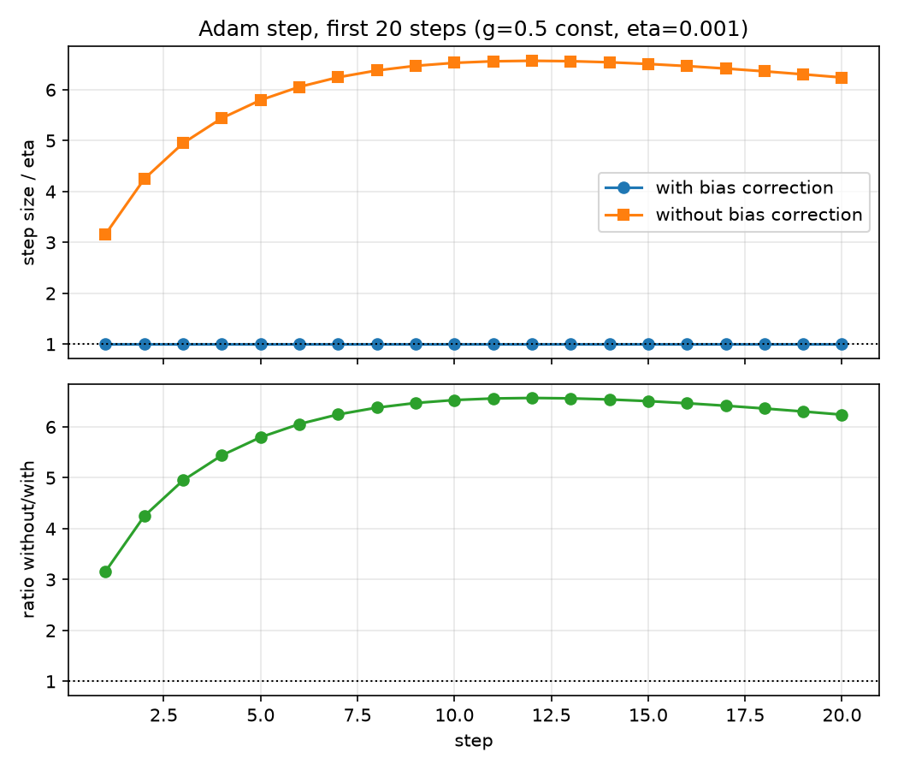
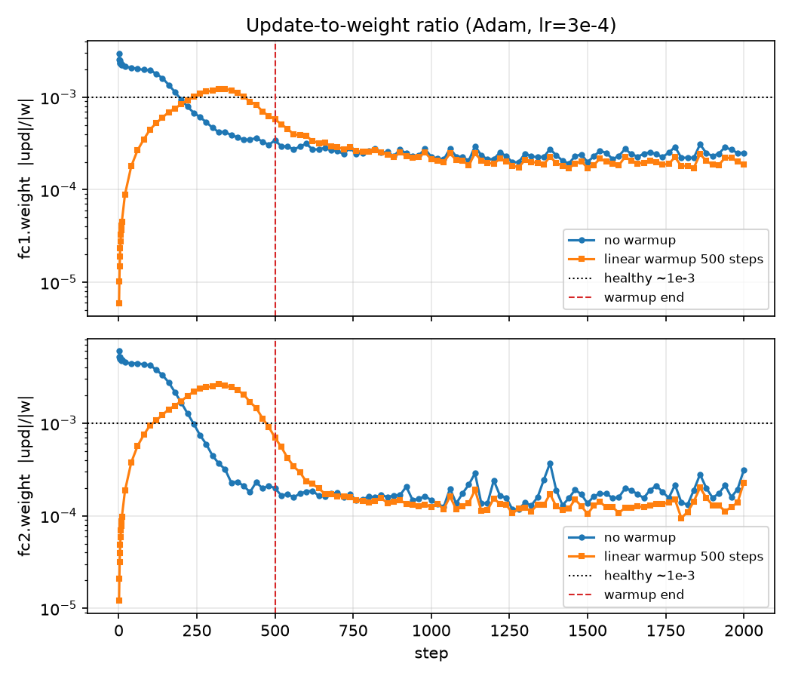
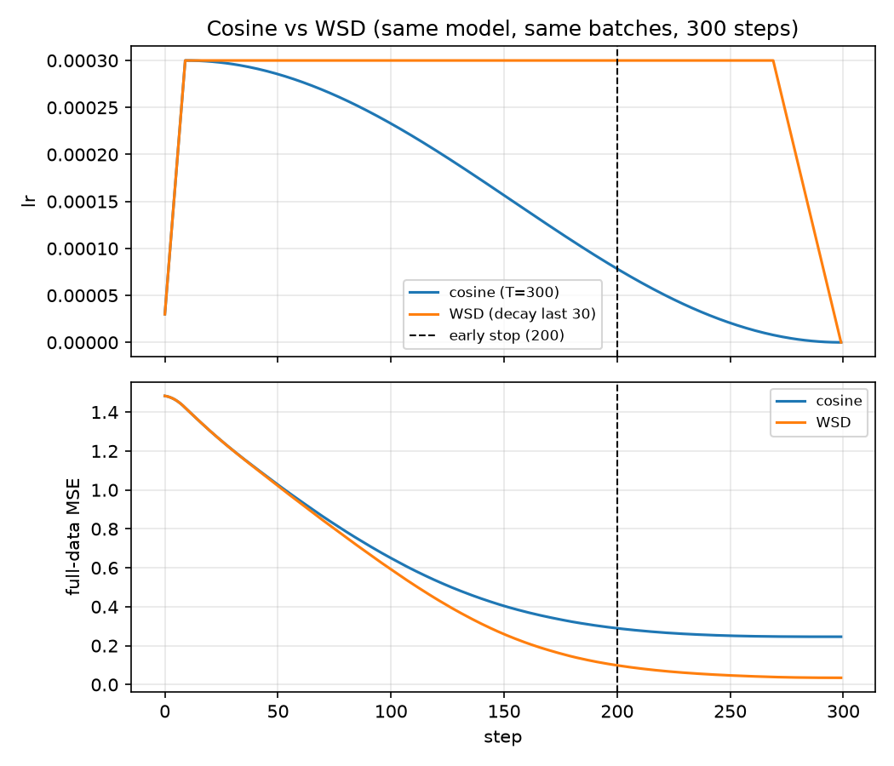
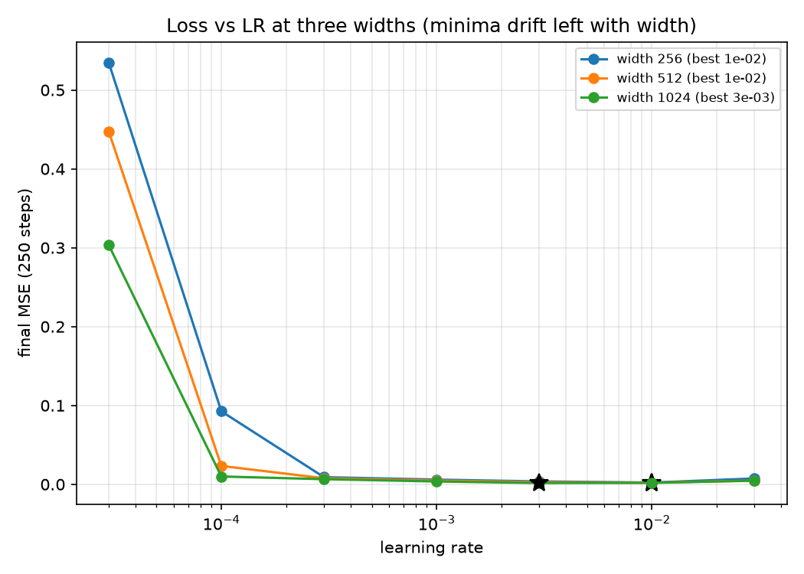

<div align="center">

# 🧠 The Adaptive Optimizer That Quietly Runs Modern AI

### *Adam, explained from first principles to the 2024–2025 frontier — with interactive demos, real measurements, and zero math gatekeeping.*

<br/>

```
   ┌─────────────────────────────────────────────┐
   │                                             │
   │    m ← β₁·m + (1-β₁)·g       ← direction    │
   │    v ← β₂·v + (1-β₂)·g²      ← scale        │
   │    θ ← θ − η · m̂ / (√v̂ + ε)  ← the move     │
   │                                             │
   │          That's it.  That's Adam.           │
   │                                             │
   └─────────────────────────────────────────────┘
```

<br/>

[](index.html)
[](https://www.python.org/)
[](https://pytorch.org/)
[](#license--credits)

<br/>

**`7` live canvases** · **`5` measured experiments** · **`3` quiz questions** · **`1` self-contained HTML file**

</div>

---

> *📖 Open `index.html` in any browser for the full interactive tutorial — 7 live canvases, an in-browser Python playground, a quiz, and the family tree of optimizer descendants, all in a single self-contained file.*

<br/>

A practical guide to the optimizer that quietly powers most of modern AI — written for people who've heard the word "Adam" but never been shown what it actually does or why it works.

This isn't a paper review. It's a hands-on walkthrough that starts with a blindfolded hiker on a mountain and ends with where the research is going in 2025. Every concept has a picture. Every claim has a number. Every demo runs in your browser.

---

## What is Adam, in one sentence?

**Adam is an algorithm that updates each parameter of a neural network by an amount proportional to the recent direction of its gradient, but normalized by how big that gradient typically is.** It remembers two running averages per parameter — a direction and a scale — and divides one by the other.

That's it. The whole algorithm is four lines:

```
m = β₁ · m + (1 − β₁) · g      # direction (first moment of the gradient)
v = β₂ · v + (1 − β₂) · g²     # scale   (second moment of the gradient)
update = η · m / (√v + ε)       # direction ÷ scale
param = param − update
```

Defaults that almost always work: `η = 3e-4`, `β₁ = 0.9`, `β₂ = 0.999`, `ε = 1e-8`.

---

## Why it matters

Adam is the **default optimizer of deep learning**. It (or one of its descendants — AdamW, Lion, Sophia, Muon) trained:

- **GPT-2, GPT-3, GPT-4** and most of OpenAI's model family
- **Llama, Mistral, Qwen** and the rest of the open-source LM ecosystem
- **Stable Diffusion, DALL-E, Midjourney** (their text encoders, at minimum)
- **BERT, RoBERTa, T5** and the entire transformer NLP stack
- **AlphaFold** (the protein structure model)
- Most of the **reinforcement learning** models you've heard of

When researchers publish a new architecture, they almost always reach for Adam or AdamW first. It's the "if you don't know what to use, use this" choice of the field.

---

## Why it works — the one-paragraph intuition

Training a neural network is a blind descent down a billion-dimensional mountain. Each parameter has its own slope. With plain SGD, you pick one step size for all of them, which means either:

- Some parameters take reasonable steps while others barely move, **or**
- Some parameters take reasonable steps while others explode off the cliff.

Adam fixes this by **giving every parameter its own automatically-tuned step size.** It estimates each parameter's typical gradient size (`v`), then divides the actual gradient direction (`m`) by that estimate. After a few steps, every parameter's update lands at roughly the same scale — proportional to the learning rate you set, regardless of how steep its local slope is.

This is why Adam trained models converge fast, don't blow up easily, and work across wildly different architectures with almost no tuning. It's not magic. It's just bookkeeping.

---

## The Numbers, Visualized

Four plots from the actual experiments. Run the scripts in `01_*.py` … `05_*.py` to regenerate them.

### 1. Bias correction is slow to fade

> **The takeaway:** without bias correction, the first step is **3.16× too big** and stays above **6× too big** for the first 20 steps. The gap drops below 1% only around step **3,925**.



| Tolerance | First step where `|without − with| / with ≤ tol` |
|---|---|
| **10%** | **1,751** |
| **5%**  | **2,375** |
| **1%**  | **3,925** |

### 2. Warmup matters for the first few hundred steps, then nothing

> **The takeaway:** without warmup, the first update is **2–3× too large** relative to the weight. Linear warmup over 500 steps tames it. After step ~500 the two curves are indistinguishable.



| Layer | No-warmup peak | Late-run avg | With-warmup peak |
|---|---|---|---|
| fc1.weight | 2.95e-3 | 2.61e-4 | 1.23e-3 (2.4× smaller) |
| fc2.weight | 6.03e-3 | 2.10e-4 | 2.63e-3 (2.3× smaller) |

### 3. WSD survives early stops; cosine doesn't

> **The takeaway:** if you stop training at step 200, **the WSD checkpoint is always decayed to its current budget** (loss 0.101 vs cosine's 0.291). The cosine run's decay is half-finished when you cut it off.



| Checkpoint | Cosine | WSD | Winner |
|---|---|---|---|
| Step 200 (early stop) | 0.291 | **0.101** | WSD — 2.9× lower |
| Step 300 (full run)   | 0.246 | **0.035** | WSD — 7.0× lower |
| 20-step cooldown from step-200 | 0.275 | **0.046** | WSD — 6.0× lower |

### 4. Best learning rate drifts with model width

> **The takeaway:** wider models want **smaller** learning rates. Fit `best_lr ~ width^(-0.87)` across three widths and extrapolate to width 4,096 → **~1.1e-3** (LOW confidence — only μP makes this rigorous).



| Width | Best LR | Final MSE |
|---|---|---|
| 256  | 1e-2 | 0.0022 |
| 512  | 1e-2 | 0.0020 |
| 1024 | 3e-3 | 0.0017 |

---

## What's in the tutorial (`index.html`)

| Section | What you'll see |
|---|---|
| **The Story** | Why a blindfolded hiker on a mountain is the right mental model for gradient descent |
| **Why SGD Fails** | An interactive bowl where SGD zig-zags while Adam threads straight to the bottom |
| **The Insight** | Sliders for β₁ and β₂; watch the direction estimate react fast and the scale estimate react slow |
| **The Algorithm** | Pseudocode + an in-browser Python playground (Pyodide) — edit and run |
| **Live Demos** | 5 canvases: 4-optimizer face-off, bias-correction gap, per-parameter step distribution, warmup, cosine vs WSD schedules |
| **Tuning** | A practical reference table of all the hyperparameters + what to do when training breaks |
| **The Family** | A timeline of Adam's descendants: AdamW, AdaFactor, Sophia, Lion, Muon, Shampoo |
| **2024–2025** | What's new in optimizer research right now — and the honest take on what's actually worth using |
| **Try It Yourself** | A 3-question quiz to check whether you actually understood the load-bearing ideas |
| **Case Studies** | 4 measured experiments with the actual numbers from running the original scripts |

Everything is in one HTML file — no network requests at runtime (except for the optional Pyodide Python playground), no external assets, no build step. Drag it onto a USB stick and it'll work on a plane.

---

## The single most useful trick

If you take one thing from this whole document, take this:

> **If training is unstable, add or extend warmup. If training is slow, sweep the learning rate. Everything else is a fine-tune.**

Both fixes cost almost nothing to try, and both fix >80% of common training problems. lr sweeps are the single highest-ROI experiment in deep learning — if you only have time for one thing, sweep.

A reasonable starting point for a transformer:

```python
optimizer = torch.optim.AdamW(
    model.parameters(),
    lr=3e-4,           # peak learning rate
    betas=(0.9, 0.95), # momentum decay, scale decay
    weight_decay=0.1,  # decoupled weight decay
)

# Warmup over the first 500 steps, then cosine decay to ~10% of peak.
scheduler = torch.optim.lr_scheduler.LambdaLR(optimizer, lambda step: (
    min((step + 1) / 500, 1.0) *  # linear warmup
    (0.1 + 0.9 * 0.5 * (1 + math.cos(math.pi * step / total_steps)))  # cosine
))
```

(The exact β₂ matters less than you think; 0.999 is the default, 0.95 is what some recent papers use. Both work.)

---

## A bit of history

Adam was published by **Diederik Kingma and Jimmy Ba** in late 2014 (ICLR 2015). The paper is famously short — about 8 pages — and contains the kind of clean, memorable result that papers aspire to.

Five years later, **Ilya Loshchilov and Frank Hutter** noticed that Adam's handling of weight decay was subtly wrong (it interacted badly with the adaptive scaling). Their fix, **AdamW**, decouples weight decay from the gradient and is now the de facto default.

In the years since, the field has spawned a small zoo of descendants — see the timeline in the HTML page for the full family tree. The interesting one as of 2024 is **Muon**, which treats weight matrices as matrices (instead of element-wise) and reportedly trains transformers 35% faster than AdamW.

---

## Where the research is right now (2024–2025)

A few honest notes:

- **Adam is no longer the unchallenged default**, but its core idea — per-parameter adaptive scaling — has never been seriously disputed. The research is about *how* to scale, not *whether*.
- **Muon is the surprise of 2024.** Keller Jordan's matrix-aware optimizer trains a transformer to the same loss in 35% fewer steps. It's now the default for the hidden layers in some NanoGPT-style setups.
- **Sign-of-gradient optimizers (Lion)** are having a moment. The simple insight — every parameter gets the same step magnitude, just a + or − — works surprisingly well at scale. Memory cost is half of Adam.
- **Second-order methods get cheap.** Sophia and Distributed Shampoo show approximate second-order methods *can* be made fast enough for large-scale training. The cost: more hyperparameters, more failure modes.
- **The "no warmup" debate** isn't settled. A 2024 paper showed transformers train fine without it; counter-papers show warmup is still needed when batch size changes mid-training. The honest answer: warmup costs nothing and removes a class of bugs. Use it.
- **Adam's known weak spots:** (1) the *edge of stability* — Adam can converge to regions where the loss curvature is sharper than the optimizer expects; (2) on small datasets, AdamW can generalize worse than SGD with momentum; (3) the bias-correction term `(1 − β₂ᵗ)` is still ~1% off after 4,000 steps — slow.

If you're starting a project today: **AdamW with β₁=0.9, β₂=0.95, wd=0.1, lr=3e-4, 500-step linear warmup, cosine decay**. You can swap in Muon or Sophia later if you have time to tune.

---

## Pop Quiz — 3 Questions That Actually Matter

Same questions as the in-page quiz. Answers are hidden — try them first, then look. (No grades, just feedback.)

---

### Q1. What does `v` in Adam track?

- **A.** The average direction of the gradient
- **B.** The average squared magnitude of the gradient (per-parameter scale)
- **C.** The loss value over time
- **D.** The current parameter value

<details>
<summary><b>Show answer</b></summary>

**✅ B — the average squared magnitude of the gradient (per-parameter scale).**

`v` is an EMA of `g²`, used to normalize updates per-parameter. The division by `√v` is what gives Adam its per-parameter adaptive step size.

- **A** describes `m`, not `v`. `m` tracks the average gradient direction; `v` tracks the average squared magnitude.
- **C** is wrong — Adam doesn't track the loss directly. It tracks gradient statistics.
- **D** is wrong — parameters are what Adam *updates*, not what it *tracks*.
</details>

---

### Q2. Why does Adam use β₁=0.9 but β₂=0.999? (Different time constants.)

- **A.** Direction should react quickly (~10-step memory); scale should react slowly (~1000-step memory).
- **B.** It was an arbitrary choice that happens to work.
- **C.** β₂ has to be larger because it operates on squared values.
- **D.** Larger β means smaller steps, so β₂ gives smaller updates.

<details>
<summary><b>Show answer</b></summary>

**✅ A — direction reacts fast (~10 steps), scale reacts slow (~1000 steps).**

The 100× difference in time constants reflects an asymmetry in *what's being tracked*. Direction should follow the current slope; scale should average over many steps to stay stable. A single outlier gradient shouldn't make the optimizer suddenly take huge steps.

- **B** is wrong — the asymmetry is principled, not arbitrary.
- **C** is wrong — the reason is conceptual, not arithmetic. The fact that `v` operates on `g²` is incidental.
- **D** is wrong. Larger β means longer memory, not "smaller steps." The relationship depends on the input.
</details>

---

### Q3. You're training a transformer. Loss spikes to NaN at step 50. What's the FIRST thing to try?

- **A.** Switch to SGD
- **B.** Double the batch size
- **C.** Add or extend learning rate warmup
- **D.** Reduce the model size

<details>
<summary><b>Show answer</b></summary>

**✅ C — add or extend learning rate warmup.**

The most common cause of early-step NaN is a too-large initial step *before the per-parameter scale estimate has settled*. The `v` estimate starts at zero and takes hundreds of steps to converge; during that window the optimizer can take absurdly large steps if you let it. Warmup costs nothing and fixes this class of bugs.

- **A** is wrong — switching optimizers won't help if the issue is initial-step magnitude.
- **B** is wrong — batch size changes gradient noise but doesn't fix step-too-large issues.
- **D** is wrong — the model isn't the problem; the step size is.
</details>

---

**Scored yourself?**

- **3/3** — you understand Adam well enough to debug a training run. Skip ahead to the family tree.
- **1–2/3** — re-read [The Insight](#the-insight) in the HTML page. Those are the load-bearing ideas.
- **0/3** — run the [Python playground](index.html) in the browser. Edit the gradients and watch what happens.

---

## For the curious: how to actually measure this stuff

The four plots you saw above come from a set of small reproducible scripts that run in a few seconds each on a CPU. They're in this repo.

To run them:

```bash
uv sync                          # installs deps once
uv run python 01_adam_by_hand.py # prints Adam's 5-step table
uv run python 02_bias_correction.py
uv run python 03_update_weight_ratio.py
uv run python 04_cosine_vs_wsd.py
uv run python 05_lr_sweep_width.py
```

Each script measures one concrete thing:

1. **Adam by hand** — Implementing the recurrence for one weight and five gradients and comparing against PyTorch. Result: max error across all six values (`m, v, m̂, v̂, step, w`) over 5 steps is **1.45e-8** — pure float32 rounding.
2. **Bias correction** — When does the `(1 − βᵗ)` correction matter? With a constant gradient, the gap between corrected and uncorrected steps takes **1,751 steps** to drop below 10%, and **3,925** to drop below 1%.
3. **Warmup** — Where does the update-to-weight ratio stop changing? It merges exactly at the end of a 500-step linear warmup. Before that, no-warmup overshoots by 2–3×.
4. **Cosine vs WSD** — When you have to stop early, which schedule is decayed to its current budget? WSD, every time. At step 200: cosine 0.291 vs WSD 0.101.
5. **LR sweep** — Does best LR drift with width? Yes — fitted power law says `best_lr ~ width^(-0.87)`. At width 4,096, extrapolated best LR ≈ 1.1e-3 (LOW confidence — 8× extrapolation off a toy task).

```bash
uv run pytest                    # smoke tests, ~1s
```

---

## Files in this repo

| File | What it does |
|---|---|
| `index.html` | The standalone interactive tutorial. Open in any browser. |
| `01_adam_by_hand.py` | Hand-coded Adam vs PyTorch for one weight, five gradients. |
| `02_bias_correction.py` | Plots bias correction's first 20 steps; finds agreement thresholds. |
| `03_update_weight_ratio.py` | Logs `‖Δw‖/‖w‖` per layer; finds warmup merge point. |
| `04_cosine_vs_wsd.py` | Same model, two schedules, early-stop + cooldown comparison. |
| `05_lr_sweep_width.py` | 21 (width × LR) runs; power-law fit; width-4096 extrapolation. |
| `tests/test_s11.py` | Smoke tests — no training, ~1s. |
| `outputs/*.png` | The four plots shown in [The Numbers, Visualized](#the-numbers-visualized). |
| `pyproject.toml` / `uv.lock` | Reproducible dependency setup. |

---

## License & credits

The HTML page and the scripts are both yours to use, modify, and learn from. The Adam paper is Kingma &amp; Ba, 2014 (arXiv:1412.6980). AdamW is Loshchilov &amp; Hutter, 2019 (arXiv:1711.05101). The Muon paper is Jordan, Jin, Bo&#322;a, Khlaifat, Ji, &amp; Peysakhovich, 2024. Pyodide is from the Pyodide team.

If you build something better on top of this, I'd love to hear about it.
